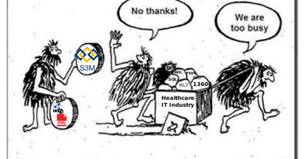

==============================
Background on Interoperability
==============================

Purpose
=======
As I was preparing this section. This came to my attention as part of the call for papers for a special edition of *Applied Clinical Informatics*. Since I frakly have almost grown weary of trying to express this in new ways. I'll let Kerstin Denecke (Bern University of Applied Sciences, Switzerland), kerstin.denecke@bfh.ch and Koray Atalag (The University of Auckland, New Zealand), k.atalag@auckland.ac.nz; say it for me.

"The recent focus on HL7’s emerging Fast Healthcare Interoperability Resources (FHIR) has directed
attention on the fact that attempts to achieve interoperability have been only partly successful in the
past despite a host of existing terminologies (for example SNOMED CT, ICD and LOINC) and standards
for health information exchange and EHR (HL7 v2,v3/CDA, openEHR/13606, IHE, DICOM etc.)."

See: https://aci.schattauer.de/fileadmin/assets/zeitschriften/ACI/CFP_ACI_Interoperability.pdf

HL7v2
-----
A great idea based on solid approaches for data exchange in the 1970s and 1980s. Not extensible beyond basic message handling.
The migration to XML has provided this approach with continued life because everything that has been produced (below) hasn't improved on semantic interoperability. 

HL7v3
-----
The idea of a reference information model as the interoperability core and domain/concept models built off of it was certainly a step in the right direction. However the design by committee approach soon led to an incoherent and bloated RIM.  Multiple attempts at extracting some kind of useful summary model have met with limited successes in CDA, C-CDA, etc. Allowing for extensions in the domain/concept models breaks the interoperability basis of the core RIM. 

Fast Healthcare Interoperability Resources (FHIR)
-------------------------------------------------
Based on the frustrations from HL7v3 experiences FHIR attempt to move the interoperability to an interface level based on a standardized set of resources. There are so many things wrong with this appraoch we cannot cover all of them here. Suffice it to say that there is no firm data validation, there is no gloabla consensus on the Resoruce Definitions and one country's rules are impacting the definition of these global resources. All resource information is geared towards English speaking usage only. This is the problem with strong ties between semantics and structure. Again, extensions are allowed and may not be knowable by information exchange partners.

openEHR/CIMI/13606
------------------
A solid approach based around a Reference Model and archetypes (domain/concept models) allowing only constraints.  However, because the IDs of the archetypes contain domain semantics and anyone is allowed to create any archetype. There is a serious risk
 that two archetypes could have the same ID and contain different constraints and semantics. This issue was addressed in 2008 and as of 2015 only a temporary patch has been created to 'allow' a unique ID in the metadata. The depth of this problem with the tools and existing systems is obviously *too big to fix*. The fact that a domain specific language (ADL) and therefore custom tools are required for data testing and validation slows adoption and introduces questionable quality control. DISCLAIMER: I worked with openEHR from 1999-2009 and was a member of the intial Architecture Review Board (ARB) for 5 years. 

S&I Framework
-------------
Another unique idea around interoperability based on workflow.  Apperntly a lot of investment but not a lot of practical application. 

National Information Exchange Model (NIEM)
------------------------------------------
Another approach based on a Reference Information Model and domain/concept models.  In some domains (man made concepts) this approach is working.  However, the Life Sciences / Healthcare working group is stagnant and the leadership there is blocking any advances. Which is fair enough since for biological domains the approach to building concept models is broken. First it allows extension in domain models. Secondly it mixes semantics and srtucture in models and lastly and most importanly for any kind of global use; all terms used in the model process must come from the Oxford English Dictionary. 

Other
-----
There are other attempts around the world such as the OpenMRS Concept platform and various HIE and IHE appraoches. They suffer most of these same issues.

Conclusion
==========

There are commonalities in these failures. The Shareable, Structured, Semantic Model (S3Model) approach solves all of these issues.
Kunteksto uses the S3Model approach to provide a common interoperability layer. The S3Model approach uses some bits of almost
all of these as well other mature, established technologies that are proven and adoptable by any domain.

Some of those failures are:

-  Confusing semantics with structure
-  Injecting domain semantics as structural components where consensus cannot be reached on a global basis.
-  Allowing extensions in the domain/concept models.

Don't be like these guys:
=========================

