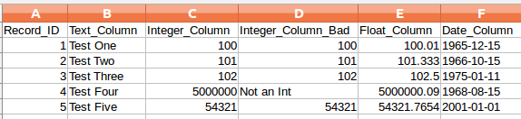
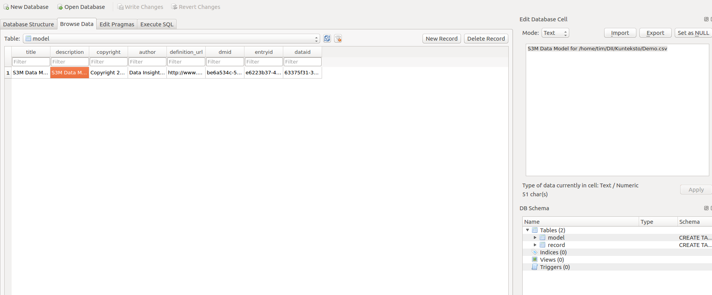
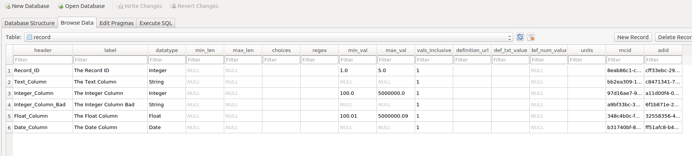
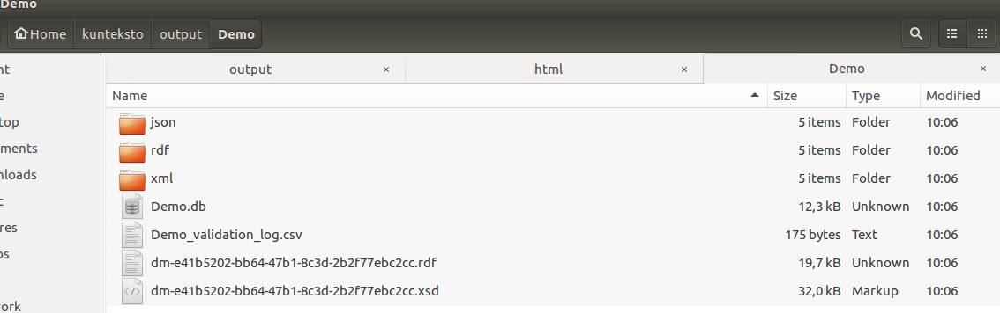

===============
Getting Started
===============

First Steps
===========

Ensure that you have the requirements and have performed the installation as described in the :ref:`install` section for your operating system. 

Then proceed to the tutorial.

.. _tutor:

Tutorial/Demo
=============

.. note::

    There is an example of a complete database, model and data set in the example_data/Demo_with_semantics.zip archive. 

Kunteksto includes a demo data file *Demo.csv*, that you can use to create your first model and data translation. This is a screenshot of the entire file as depicted in a spreadsheet. 

Notice that there are a few columns to demonstrate various datatypes as well as one column with mixed types that might look like an integer column at first glance but has a missing value. 

This tutorial does not demonstrate all of the functionality of Kunteksto but it does demonstrate the process of creating a model based on data and then enhancing that data with improved semantics.

Kunteksto is a commandline tool that uses a combination of commandline options as well as a configuration file.
The configuration file is covered in :ref:`config`. The default configuration is fine for the tutorials.

.. _tutorsteps:

Tutorial Steps
==============

- Navigate to the directory where you installed Kunteksto.

- With the virtual environment active.

.. caution::

    If you closed and reopened a new window then you need to activate the environment again. 

    **Windows**

    .. code-block:: sh

        activate <path/to/directory> 

    **or Linux/MacOSX**

    .. code-block:: sh

        source activate <path/to/directory> 

Start Kunteksto:

.. code-block:: sh

    kunteksto

.. note::

    You can see all of the Kunteksto commandline options using the --help flag.

    .. code-block:: sh

        kunteksto --help

- At the **Enter a valid mode:** prompt, type *all*

- At the **Enter a valid CSV file:** prompt, type *example_data/Demo.csv* 

- Kunteksto will analyze the input file and create a results database of this CSV file named *output/Demo/Demo.db*  

- The *kunteksto/output/Demo/Demo.db* file should open in the SQLiteBrowser. 

.. caution::

    On Windows the SQLite DB Browser may not open. You will receive either a FileNotFound Error or a Permission Error.

    If it does not automatically open then you will need to manually open the *kunteksto/output/Demo/Demo.db* file with the tool you installed to open SQLite Databases. For example, open SQLite DB Browser from the Windows menu and then use File->Open to open *kunteksto/output/Demo/Demo.db*. 

    Later in the :ref:`config` section of these docs you will learn how to fix this issue. For now, continue with the tutorial.

- In the SQLiteBrowser, select the *Browse Data* tab and the *model* table. 

- This image depicts the view of the model table and below that are descriptions of each of the fields to be edited; or not. 

.. note::

    We recommend opening images in a new tab for full resolution. 

**Model table field descriptions:**

	- *title* is a free text title for your data concept contained in the CSV file.
	- *description* is a free text, elborated description of the data contained in the CSV file.
	- *copyright* enter the name of the copyright holder of the model
	- *author* enter the name of the author of the model
	- *definition_url* enter a URL (or at least a URI) to a vocabulary or ontology or a webpage that describes or defines the overall concept of the data. 

.. warning::

	- *dmid* System Generated, **Do Not Edit**
	- *entryid* System Generated, **Do Not Edit**
	- *dataid* System Generated, **Do Not Edit**  

Edit the title, description, copyright, author and contributor fields as desired. These fields describe the overall metadata for your data model. This metadata describes the where, when and why the data is being modeled. Insure that you do not edit the fields in the warning box.

You will notice that some of this information can be obtained from the PDF. For other items you have to use your knowledge of the dataset as a domain expert. In this *demo* we are going to say that we have a local ontology that describes the columns and that information is provided below in the *Adding Semantics* section. 

.. warning::

    You *MUST* use the *Apply button* on the bottom right, to save changes when editing fields. Then use the *Save Changes* button, on the top toolbar, before exiting the DB Browser.

- Select the record table. Note that there is a record for each column of data in Demo.csv. If there is only one record then the likely problem is that an incorrect field delimiter was chosen or the default was changed in the config file.  

   - Each record has a number of fields that allow you to describe more about your data. With your FileManager, navigate to the *kunteksto/example_data* subdirectory and open the *Demo_info.pdf* file. This file simulates what often purports to be a data dictionary that you might receive with a dataset. You will use this to improve the computable semantics of your data. 

   - Though some fields are pre-filled, it is only a guess and may not be accurate.
   
   - It is up to you to be as accurate as possible in describing your data to improve quality and usability.

**Record table field descriptions:**

.. warning::

    - *header* is the column names from the data file. **Do Not Edit**.

Edit these columns:

    - *label* is a variation of the header text and should be edited as needed to provide a meaningful name for the column.
    
    - *datatype* the analyzer attempts to guess the correct datatype for the column. You must enter the correct type; string, integer, decimal or date. 
    
    - *min_len* for **string** columns enter the minimum length restriction if there is one.
    
    - *max_len* for **string** columns enter the maximum length restriction if there is one.
    
    - *choices* for **string** columns you may enter a set of choices to restrict the valid values. Separate each choice with a pipe '|' character.
    
    - *regex* for **string** columns you may enter a regular expression (`XML Schema syntax <http://www.xmlschemareference.com/regularExpression.html>`_) to constrain the valid string values.
    
    - *min_val* enter the minimum value restriction for **integer or decimal** columns.
    
    - *max_val* enter the maximum value restriction for **integer or decimal** columns.	
    
    - *vals_inclusive* for **integer or decimal** columns, are the minimum and maximum values inclusive in the valid values range. Enter a '1' for yes or a '0' for no.
    
    - *definition_url* enter a URL (or at least a URI) to a vocabulary or ontology or a webpage that describes or defines the meaning of the data in this column.
    
    - *pred_obj_list* optionally enter any additional predicate object pairs to be used to define this resource. Enter them one per line with the predicate and object separated by a space character. 

.. warning::
    You may use namespace abbreviations **ONLY** if they are in the list below or have been defined in the [NAMESPACES] section of the configuration file. To do otherwise will generate an invalid model and be pointless.
    
    - *def_txt_value* for **string** columns enter the default value for a string datatype column, if there is one.
    
    - *def_num_value* enter the default value for a decimal or integer datatype column, if there is one.
    
    - *units* **mandatory** units value for all **decimal or integer** datatype columns. For decimal columns this should come from a standard units vocabulary such as `Ontology of units of Measure <https://github.com/HajoRijgersberg/OM>`_ or `The Unified Code for Units of Measure <http://unitsofmeasure.org>`_. For integer columns where the values are *counts* you should enter the name of the item(s) being counted. For example, if this number represents the number of widgets created today. Then enter "Widgets* here. 

.. warning::

    - *mcid* System Generated, **Do Not Edit**
    - *adid* System Generated, **Do Not Edit**  

Adding Semantics
----------------

Editing the fields in this database will improve the semantics in your model that describes the data. This allows your data consumers to make better decisions about what the data means. Kunteksto produces an executable model that can be used in various validation and knowledge discovery scenarios.

In the **model** table you should change the fields as you wish to match your organization. The field *definition_url* is where we point to the overarching definition about this datamodel. This URL will be used as the *object* portion of a RDF triple where the *subject* is the unique datamodel ID (dm-{uuid}) and the *predicate* is **rdfs:isDefinedBy**. We see in our *Demo_info.pdf* file that it is declared to be found at https://www.datainsights.tech/Demo_info.pdf so this is our URL for this field.  

In the **record** table, the *definition_url* and *pred_obj_list* are where we add semantics in RDF format. The *definition_url* is formatted the same as for the *definition_url* column in the model table. 

The *pred_obj_list* column is slightly different in that you need to supply both the predicate and the object. 

.. note::

    Kunteksto defines these namespace abbreviations:

    - vc="http://www.w3.org/2007/XMLSchema-versioning"
    - xsi="http://www.w3.org/2001/XMLSchema-instance"
    - rdfs="http://www.w3.org/2000/01/rdf-schema#"
    - rdf="http://www.w3.org/1999/02/22-rdf-syntax-ns#"
    - owl="http://www.w3.org/2002/07/owl#"
    - xs="http://www.w3.org/2001/XMLSchema"
    - xsd="http://www.w3.org/2001/XMLSchema#"
    - dc="http://purl.org/dc/elements/1.1/"
    - dct="http://purl.org/dc/terms/"
    - skos="http://www.w3.org/2004/02/skos/core#"
    - foaf="http://xmlns.com/foaf/0.1/"
    - sioc="http://rdfs.org/sioc/ns#"
    - sh="http://www.w3.org/ns/shacl#"
    - s3m="https://www.s3model.com/ns/s3m/"

For example, if you want to define an alternate label in addition to the label column, you could use the SKOS *skos:altLabel* predicate. However, if you want to use the predicate *isSettingFor* from the `Information Objects ontology <http://www.ontologydesignpatterns.org/ont/dul/IOLite.owl>`_ then you would need to first define an abbreviation for this ontology in the [NAMESPACES] section of the configuration file. You may do this while editing the database. Just be sure to save the new configuration before closing the database editor so that your changes are saved before the model generator runs. 

.. note::

    The field is an open text field so you must use care in making your entries here.  Each predicate/object pair is entered on one line with a space between the predicate and object. For example:

.. code-block:: sh

     skos:altLabel Blue Spot
     dul:isSettingFor https://www.datainsights.tech/thingies/PurpleKnob

The *object* portion can contain spaces. However, the first space character defines the separation between the *predicate* and *object*. 

Again, the information in the table in the PDF can help you determine additional meaning about the data if you are not a domain expert in this area of *Fake System* information. If you do not already have an ontology defining the meaning of these columns then you can search in places like `Linked Open Vocabularies <http://lov.okfn.org/dataset/lov>`_  `Biontology <https://www.bioontology.org/>`_  or even places that aren't formal ontologies but contain reliable definitions and descriptioins such as `a dictionary <http://www.dictionary.com/>`_ or an `encyclodpedia <https://en.wikipedia.org/wiki/Main_Page>`_  

- Once you have completed the data description step, **saved any changes to the configuration file** and **saved your changes** using the *Write Changes* button in the top toolbar, close the DB Browser. You will then see that model generation happens followed by data generation. 

.. warning::

    If for some reason you had to manually open the database with sqlitebrowser or another tool, then the processing will not continue automatically. Use the command below to restart the model and data generation process:

    .. code-block:: sh

        kunteksto -i example_data/Demo.csv -m all -db output/Demo/Demo.db

    This tells Kunteksto to use the Demo.db and restart model and data generation with Demo.csv.

- In the *output/Demo* directory along with the Demo.db you will see an XML Schema (\*.xsd) model file and a RDF (\*.rdf) file. These are the structural and semantic models that can be used in your analysis as well as shared with others to better describe the data. The RDF file is actually extracted from the XML Schema so only the schema needs to be shared in order to distribute full structural and semantic information in an executable model. Data Insights, Inc. provides a utility with S3Model to extract the semantics from the schema data models. 

- The *all* mode causes the creation of data instances (XML, JSON and RDF) for each record in the CSV file that are semantically compliant with the RDF and will be valid according to the XML Schema. Demonstrating that the models describe the data. The RDF file does include some constraint definitions based on `Shapes Constraint Language (SHACL) <https://www.w3.org/TR/shacl/>`_ There is no builtin processing for these constraints due to the lack of maturity of this technology. Expect SHACL to become more useful in the near future. 

Full validation is performed via XML for both the data model and data instances. In addition, an XML catalog is dynamically generated for each project and is written to the catalogs subdirectory.

- Notice that the validation file *Demo_validation_log.csv* shows four valid records and one invalid record. The invalid record is due to a 'NaN' entry in a numeric column. 

.. note::

    The S3Model eco-system has a much more sophisticated ability to handle missing and erroneous data. The details are available in the S3Model documentation. This generally requires the model first approach whereas Kunteksto is an after-the-fact bridge.

Additional Steps
----------------

In realworld situtaions we will often be generating data on a continuing basis for this same model. To demonstrate this functionality you will use the Demo2.csv file. From the commandline issue this command: 

.. code-block:: sh

    kunteksto -i example_data/Demo2.csv -m generate -db output/Demo/Demo.db

This says to use the *Demo2.csv* file with the mode for generate and the database to reuse is the *Demo.db*. The information for the XML Schema is gathered from the information in the database and the \*.xsd file is assumed to be in the directory with the database. A new validation log is generated *Demo2_validation_log.csv* and it will have two files that are invalid. 

It is important to realize that the CSV files must represent **EXACTLY** the same type of data in order to reuse the database and schema. If you issue this on the commandline: 

.. code-block:: sh

    kunteksto -i example_data/Demo3.csv -m generate -db output/Demo/Demo.db

You will see this error message:

.. code-block:: sh

    There was an error matching the data input file to the selected model database.
    Datafile: Bad_Column_name  Model: Column_1

and no new data files were generated because the data format, in this case a column name, didn't match. 

Using this rich data
====================

Now that we have all these files, what can we do with them?

In the :ref:`config` section you will learn about automatically placing your data into appropriate databases/repositories for further usage. If yours is not yet supported, you an manually import from the filesystem. Of course you can also contribute, see :ref:`develop`.

In order to exploit the richness of the RDF data you will need to also load these files into your RDF repository:

- s3model/s3model.owl
- s3model/s3model_3_0_0.rdf
- output/Demo/dm-{uuid}.rdf

In your XML DB or in the appropriate place in your data pipeline you will want to use the dm-{uuid}.xsd data model schema to validate your XML data. You should be using XML Catalog files and an example is created for each project in the *catalogs* directory. 

Your JSON data instances can be used as desired on the filesystem of in a document DB. 

There is a growing effort to expand the current data science algorithms to exploit richer data formats such as RDF. 
Some references to get you started:

- `Towards Analytics on Top of Big RDF Data <https://www.youtube.com/watch?v=VoEEb_oGN7w>`_ (video).
- `Linked Data meets Data Science <https://ablvienna.wordpress.com/2014/10/28/linked-data-meets-data-science/>`_
- `RDF on KDNuggets <http://www.kdnuggets.com/tag/rdf>`_
- `RDF on Data Science Central <http://www.datasciencecentral.com/profiles/blog/list?tag=RDF>`_

Why multiple copies of the same data?
-------------------------------------

You can choose which types to actually create in the :ref:`config` file. But each one has different qualities. For example the XML data is the most robust as far as any data quality validation is concerned. The RDF is more useful for exploration and knowledge discovery and the JSON is simpler to use in some environments.

More Information
----------------

- To gain a better grasp of the capability of Kunteksto, you may also want to perform the :ref:`pimatutor`. This tutorial is based on the popular Pima Indian Diabetes study that is used in many other data science tutorials. The data is realistic as opposed to this simple demo. Also, you will be actually looking up semanntics in online repositories.  

