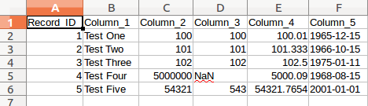

===============
Getting Started
===============

First Steps
===========

Ensure that you have the requirements and have performed the installation as described in the :ref:`install` section for your operating system. 

Then proceed to the tutorial.

.. _tutor:

Tutorial
========

Kunteksto includes a demo data file that you can use to create your first model and data translation. This is a screenshot of the entire file. 

Notice that there are a few columns to demonstrate various datatypes as well as one column with mixed types that might look like an interger column at first glance. 

This tutorial does not demonstrate all of the functionality of the data translator but it does demonstrate the process. Likewise, Kunteksto itself only provides around 40% of the full capability of S3Models. Other tools provide all of the S3Model capability but are not designed to translate existing data. 

The Kunteksto application window looks like this when first opened.

.. image:: _images/initial.png
    :width: 800px
    :align: center
    :height: 600px
    :alt: Initial Window

The first step is to select your data file and then analyze that data file. Data files must be plain text (often called CSV) files that have each record on a row, seperated by a CR/LF (or CR depending on the operating system) and each field in the record delimited by a separator. 

The supported field separators are:

- comma : ","
- semi-colon : ";"
- colon : ":"
- pipe : "|"
- dollar sign : "$"

The first row of the data file **MUST** contain column names. These are also sometimes referred to as column headers.   

.. _tutorsteps:

Tutorial Steps
--------------

1. Start Kunteksto: python3 kunteksto.py

2. Select the semi-colon separator using the select box (Demo.csv uses a semicolon ';' for the field separator).

3. Select the demo file, **Demo.csv** using the open file dialog.

4. Kunteksto will create a results database of this CSV file named Demo.db when the Analyze CSV button is clicked. 

.. image:: _images/analyze.png
    :width: 800px
    :align: center
    :height: 600px
    :alt: Click Analyze CSV

5. Open the Demo.db file using the DB Browser for SQLite if it does not automatically open. 

6. Select the *Browse Data* tab and the *model* table. Edit the title, description, copyright, author and contributor fields as desired. These fields describe the overall metadata for your data model. Basically it describes the where, when and why the data is being modeled. When you click on a field it place the contents in the larger box on the right side for easier editing.

.. image:: _images/edit_model.png
    :width: 800px
    :align: center
    :height: 600px
    :alt: Edit Model

Field descriptions:

	- *title* is a free text title for your data concept contained in the CSV file.
	- *description* is a free text, elborated description of the data contained in the CSV file.
	- *copyright* enter the name of the copyright holder of the model
	- *author* enter the name of the author of the model
	- *definition_url* enter a URL (or at least a URI) to a vocabulary or ontology or a webpage that describes or defines the overall concept of the data. 
	- *dmid* System Generated, **Do Not Edit**
	- *entryid* System Generated, **Do Not Edit**
	- *dataid* System Generated, **Do Not Edit**  

7. Select the record table. Note that there is a record for each column of data in Demo.csv. If there is only one record then the likely problem is that an incorrect separator was chosen.  

   - each record has a number of fields that allow you to describe more about your data.
   - though each field is pre-filled it is only a guess and may not be accurate.
   - it is up to you to be as accurate as possible in describing your data to improve reusability

.. image:: _images/record_table.png
    :width: 800px
    :align: center
    :height: 600px
    :alt: Edit Record

Field descriptions:

	- *header* is the column names from the data file. **Do Not Edit**.
	- *label* is a copy of the header text and should be edited as needed to provide a meaningful name for the column.
	- *datatype* the analyzer attempts to guess the correct datatype for the column. You must enter the correct type; string, integer, float or date. 
	- *min_len* enter the minimum length restriction if there is one.
	- *max_len* enter the maximum length restriction if there is one.
	- *choices* for string datatypes you may enter a set of choices to restrict the valid values. Separate each choice with a pipe '|' character. 
	- *regex* for string datatypes you may enter a regular expression (XML Schema syntax) to constrain the valid string values.
	- *min_val* enter the minimum value restriction for integer or float columns.
	- *max_val* enter the maximum value restriction for integer or float columns.
	- *vals_inclusive* are the minimum and maximum values inclusive in the valid values range. Enter a '1' for yes or a '0' for no.
	- *definition_url* enter a URL (or at least a URI) to a vocabulary or ontology or a webpage that describes or defines the meaning of the data in this column. 
	- *def_txt_value* enter the default value for a string datatype column, if there is one.
	- *def_num_value* enter the default value for a float or integer datatype column, if there is one.
	- *units* enter the units value for a float or integer datatype column. This can be an abbreviation but should come from a standard units vocabulary such as https://github.com/HajoRijgersberg/OM or http://unitsofmeasure.org/trac For integer columns where the values are *counts* you should enter the name of the item(s) being counted. This could be the same as the lable or column header if desired.
	- *mcid* System Generated, **Do Not Edit**
	- *adid* System Generated, **Do Not Edit**  

8. Once you have completed the data description step and closed the DB Browser, click the Generate Model button. You will find an XML Schema model file and an RDF file in the output directory. These are the structural and semantic models that can be used in your analysis as well as shared with others to better describe the data.

.. image:: _images/output_dir.png
    :width: 800px
    :align: center
    :height: 600px
    :alt: Output Directory

9. Now click the Generate Data button and Kunteksto will create data instances for each record in the CSV file that are semantically compliant with the RDF and will be valid according to the XML Schema. Demonstrating that the models describe the data. 

