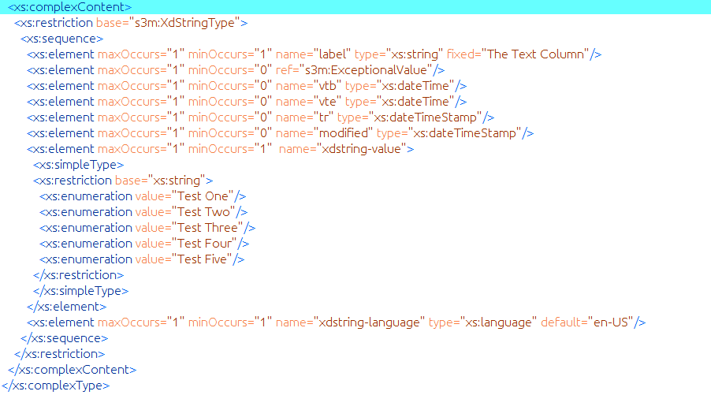

=================
Technical Details
=================

*this section is still in draft form*

**Audience:** Interoperability geeks and systems engineers. 

The data manipulation process to transform standard CSV data into a semantically enhanced S3M data model and data instances is detailed here. Prior to initiating the analysis and model generation process you must know which data field (column) delimiter is used in the CSV. The delimiter / separator options are; comma, semi-colon, colon, pipe or dollar sign characters. If your file uses something else then you must re-save/create a new file using one of these. Also, if you are using Linux, the output directory must already exist. There is no Create a Folder option in the selection window on Linux. You should also check the kunteksto.conf file to enter the location of the SQLiteBrowser tool. By default it is /usr/bin/sqlitebrowser

Analysis
========

- Kunteksto will always generate the XML and RDF files. If the JSON selection is made it will also generate JSON from the XML.

- An output directory must be chosen. During generation the XML Schema model and the model RDF definitions will be placed in this directory. The XML, RDF and optional JSON data will files will all be placed in subdirectories of this output directory.

- There are two modes for CSV analysis; Full and Basic (described in detail below). The analysis process creates an SQLite database that contains information describing structural aspects of your CSV file. This database will be created in the same directory with your CSV file and will have the same basename as the CSV file with a '.db' extension replacing the '.csv'.

- The database has two tables; *model* and *record*. The model table has one data record for the model metadata information. This is the metadata in the XML Schema as shown here:

.. image:: _images/metadata.png
    :width: 800px
    :align: center
    :height: 600px
    :alt: Metadata

The record table has a data record for each column found in the CSV file. The information contained in the database after analysis is determined by the analysis mode. Ultimately the user is responsible for the accuracy and completeness of the model and data record semantics and ultimately the quality of the data. Remember that the software doesn't read minds, it can only make guesses about the data it sees.

- Both analysis modes will create a model table that contains user editable fields for *title*, *description*, *copyright*, *author*, and *definition_url*. The fields *dmid*, *entryid* and *dataid* must not be edited. (See #6 in the :ref:`tutorsteps`)

The record table contains user editable fields; *label*, *datatype*, *min_len*, *max_len*, *choices*, *regex*, *min_val*, *max_val*, *vals_inclusive*, *definition_url*, *def_txt_val*, *def_num_val*, *units*. The fields *header*, *mcid*, and *adid* must not be edited by users. (See #7 in the :ref:`tutorsteps`)

Basic Analysis
--------------
The single record in the *model table* is filled in with generic information and should be edited by the data originator. The fields are self explanatory but we do want to empasize that the definition_url field is very important and should point to some URL that explains the overall data use and structure. In other words; why does this data exist and why was it collected?

The *record table* contains a data record for each column of your CSV file. You must not edit the *header* column. If you do edit the *header* column then Kunteksto will probably break but if not it will certainly generate a bad model and data. 

The *label* column will intitally taken from the *header* column. You are encouraged to edit this *label* column to be a short description or semantic label for the data. Think about; what would my colleagues use as a search term in a large database when looking for this data? 

In the basic analysis mode the *datatype* field is filled with 'String' for all data columns. This column **must** contain one of these words; String, Integer, Float or Date. These are not case sensitive. It is crucial that the correct datatype is used for each column. 

- Integer: usually things that we count and do not have a decimal component. For example; pregnancies, cars, cigarettes, gunshots, etc.
- Float: things that are quantities and usually have one or more decimal places. For example; weight of 1.6 kg, concentration of 1.01 mg/L, etc. 
- Date: an unambiguous date in the format YYYY-MM-DD 
- String: anything that is not one of the above. 

The *min_len* column is used only for strings to state the minimum length of valid data. 

The *max_len* column is used only for strings to state the maximum length of valid data. 

The *choices* column is used only for strings to state the list of valid choices for this data column. The choices are entered on one line and each choice is separated with the pipe '|' character. Spaces are kept as entered including leading and trailing spaces. For example; choices of: High|Medium|Low would mean that only those three strings would be valid in this data column. You need to be certain that all possible choices are entered and be aware that these are case sensitive. Kunteksto generates strict enumeration values from these choices.

The *regex* column is used only for strings to allow you to enter a regular expression constraint to define the valid values for the column. A description and tutorial on regular expressions is beyound the scope of this guide. We recommend http://www.xmlschemareference.com/regularExpression.html 

The *min_val* column is used only for integers and floats to state the minimum value of valid data. 

The *max_val* column is used only for integers and floats to state the maximum value of valid data. 

The *vals_inclusive* column is a a boolean flag used only for integers and floats to indicate if the minimum and maximum values entered are inclusive.  In version 1.x this flag is ignored and all min and max values are considered inclusive.

The *definition_url* is required for all datatypes and outside of the datatype itself it is the most important column to complete correctly. This must be a URL (or at least a URI) that points to a specific definition of this data column. Often this will be a controlled vocabulary such as one linked to on http://bioportal.bioontology.org/ or possibly https://cdebrowser.nci.nih.gov/CDEBrowser/ for healthcare. Other large vocabularies that may be used include standards from OMG http://www.omg.org/ or https://www.edmcouncil.org/financialbusiness. If none of these are appropriate then a link to an internal ontology or project website and some definition page or PDF is useful. 

The *def_txt_value* column is used only for strings to state a default value for the model. 

The *def_num_value* column is used only for integers and floats to state a default value for the model. 

The *units* column is required for integers and floats. For integers it should be the name of the things being counted and for floats it should be a stand unit of measure abbreviation understood within the domain.

This image shows how the min, max values are represented in the XML Schema as well as a link to a complexType to represent the Units.

.. image:: _images/min_max_units.png
    :width: 800px
    :align: center
    :height: 600px
    :alt: Min Max Values

Full Analysis
-------------

The differences in Full and Basic analysis are that in Full the tool attempts to guess some of the values.  For example it will attempt to guess datatypes, min_val and max_val. This can be a bit time consuming and may not be a good choice for very large datasets. 

It is important that the modeler review these guesses carefully.  For example just because somethings pass the tests for integers does not mean it is an integer datatype. For example categorical variables 1 and 0 should be a String with those as choices. The tool will guess these as Integer with those as min and max values. This is ofcourse incorrect and needs to be edited.

Using SQLiteBrowser
===================

This is a powerful open source tool for which you may find many uses. Our needs use a very small part of the capabilities and are described here. 

When the Analyze CSV button is clicked in Kunteksto the tool goes through the analysis process, Basic or Full, and creates a database using the SQLite engine. It will then launch the SQLiteBrowser tool with the database open. Below the primary menu options you will see a set of tabs. Click on the Browse Data tab. This will initally show the *model table* and its one record. 

By default the title column will contain 'S3M Data Model'.  Double click on this text and it opens an editor where you can enter your desired title. Clcik the Ok button to complete the task. 

Edit the description, copyright, author and definition_url columns in the same manner as the title column. 

Notice above the tabs there are four options; New Database, Open Database, Write Changes, Revert Changes. After making your desired changes to the model table you must click on the Write Changes button to actually save your changes to the database. 

Under the tabs there is a pulldown labeled 'Table:'. Use this to select the *record table*. You should see a data record line for each column in your CSV file.  If you only see one line then you probably did not choose the correct delimiter. Close SQLiteBrowser, select the correct CSV separator (delimiter) in Kunteksto and re-analyze the CSV. 

Once you have completed editing the database and providing all of the constraints and semantics be certain that you click the *Write Changes* button.  Exit the the SQLiteBrowser.

Models & Data
=============

Now we get to the reason we all came here.  To create a semantically enhanced model, validatable data and an RDF graph that can be used for machine processing guidelines and data discovery operations. 

Click on the Generate Model button. You will see a display for the path and filename of the generated XML Schema. This schema is a S3Model data model (DM) that details the constraints and semantics for this data based on the analysis and the information you entered. Additionally a file with the same name and an '.rdf' extension is created in the same folder. This file contains the RDF triples extracted from the semantics embeded in the DM. This means that you can send your data and this DM to anyone anywhre and they have access to the semantic information and syntactic constraints in order to make processing decisions about this data. All of this is in a machine processable format so no human ever has to read a PDF to see if this is useful data for their needs. 

The Generate Data button with; generate data.  It will always generate validatable XML instances and RDF triples for each data file.  If the Format selected is JSON it will also automatically create round-tripable JSON data files as well.  

The filenaming process here is not mandatory. If some type of sequential naming approach is useful in your context then this can be edited. 

You can now import your RDF into a graph DB or other triple store.  You can import you XML into an XML DB or process it into an SQL DB or any document DB.  Those decisions are yours. We have some approaches and best practices that we have discovered and will share with customers. 

